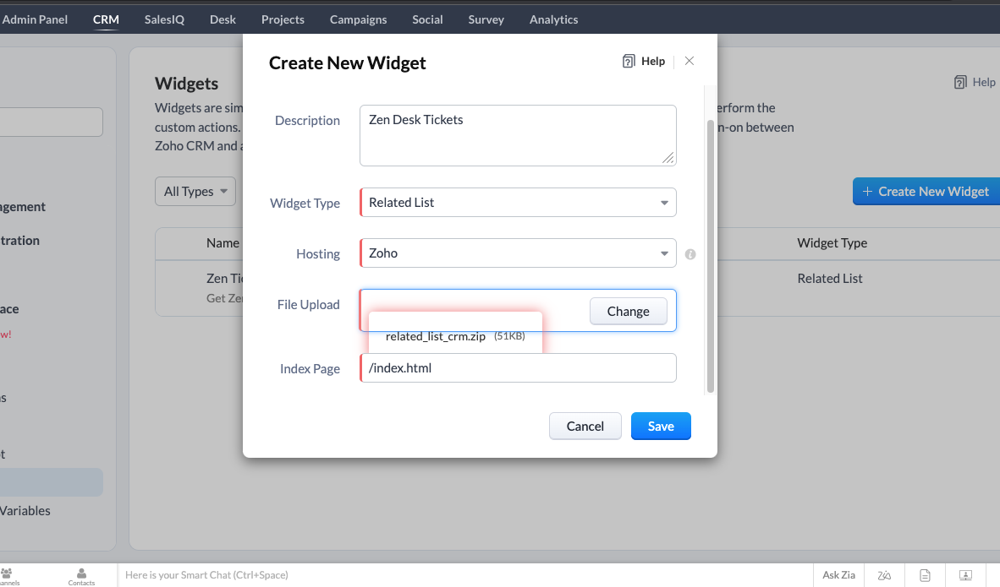

# Zen Desk Integration using Zoho Widget

#### Step 1: Download and Create Zoho CLI and Create A Project using following command

    $  npm install -g zoho-extension-toolkit
    $  zet init
    $  zet {project_name}
    $  cd {project_name}

#### Step 2: Go to app folder use widget.html or create html page as required
    
#### Step 3: Add Zoho CDN
    
    https://live.zwidgets.com/js-sdk/1.1/ZohoEmbededAppSDK.min.js

#### Step 4: Create Page as you want

#### Step 5: Pack the code using zet command    
    
    $ zet pack

    A new zip file will be created on dist folder

### Step 6: Creating A Widget

-   Go to Zoho Crm settings/widgets
-   Click on Create New Widget Button
-   Give Name Select Widget Type and Select Hosting as zoho
-   Upload zip file created using zet command
-   point the index page (staring page)
-   click on save

### Step 7: Create Related List with Widget and Attach Function

#### Execution Demo

https://drive.google.com/file/d/1r468focrbnT8yvQRFXpnx1Bo4ghD4foR/view?usp=sharing

